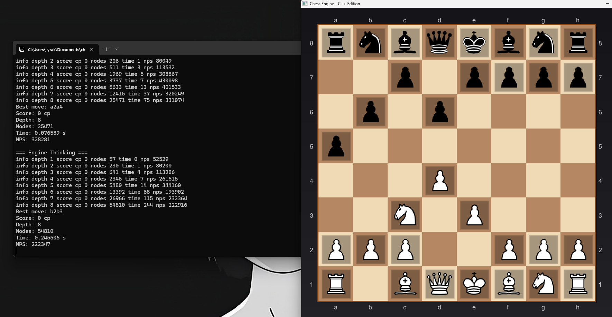

# Chess Engine C++

#### Prerequisites
- C++17 compatible compiler (GCC, Clang, MSVC)
- SDL2, SDL2_image, SDL2_ttf libraries

# Features
- SDL2 interface with shadows, highlights, and smooth animations.
- 100,000+ nodes per second with bitboard representation.
- Watch the engine think with live depth, nodes, and evaluation.

# Boards
- Bitboards with magic bitboards for sliding pieces.
- Pre-calculated attack tables for pawns, knights, kings.
- Efficient move generation.

# Performance Comparison
| Engine | ELO | NPS | Type | GUI |
|--------|-----|-----|------|-----|
| **This Engine** | **~1800** | **100K** | **Educational** | **✅ Yes** |
| Sunfish (Python) | ~1500 | 1K | Educational | ❌ No |
| TSCP | ~1600 | 20K | Educational | ❌ No |
| Vice | ~2000 | 200K | Educational | ❌ No |
| Stockfish | ~3600 | 100M+ | Professional | ❌ No |

## Technical Specifications
| Feature | Specification |
|---------|--------------|
| **Playing Strength** | ~1800 ELO |
| **Search Speed** | 100,000 nodes/second |
| **Search Depth** | 8 plies (3 seconds) |
| **Board Representation** | Bitboards (64-bit) |
| **Search Algorithm** | Alpha-Beta with PVS |
| **Evaluation** | Material + Positional + Structure |
| **Transposition Table** | 64 MB with Zobrist hashing |

# Purpose and Disclaimer
This project was created **exclusively for educational and informational purposes** to demonstrate chess programming concepts, AI algorithms, and software development techniques.

**Disclaimer**: The author assumes no responsibility for how this software is used. Users are solely responsible for their use of this code and any consequences thereof. This software is provided "as is" without warranty of any kind.

# License
This project is licensed under the MIT License - see the [LICENSE](LICENSE) file for details.
